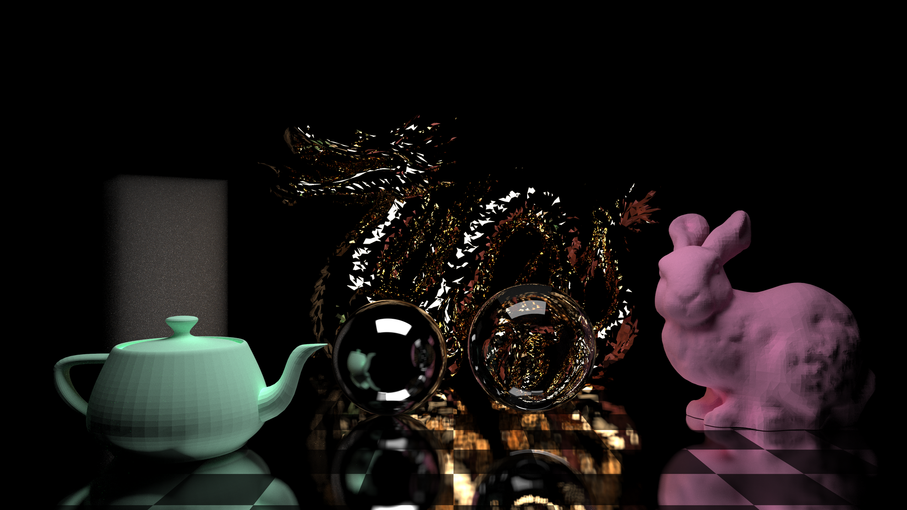

# clovers 🍀 ray tracing in rust 🦀

## Usage

Currently, this project is highly experimental. Things change all the time.

- `clovers/` contains the library
- `clovers-cli/` contains the CLI application
- `clovers-app/` contains the GUI application
- `clovers-gpu/` contains the shaders for GPU accelerated rendering

Run `cargo doc --open` to build and open the documentation.

## License

This project does not currently have an open license, you can consider it proprietary software that happens to have its source visible.
I might pick an open license at some point, or make this project private.
No guarantees, sorry!

If you make a PR to this repository, please acknowledge that you are giving all rights to this project.
